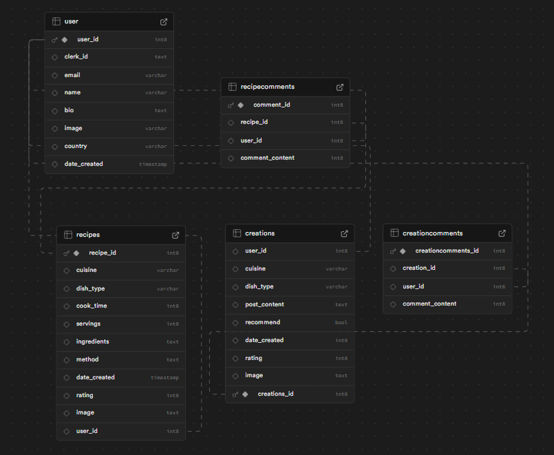
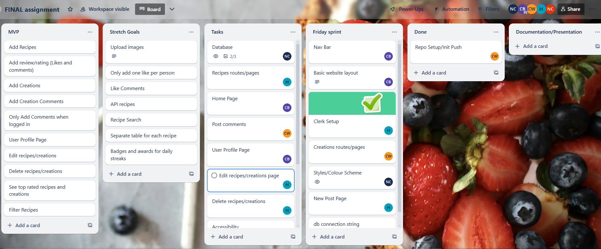

Week 12 - Final Group Project - Spoonly

Project name: Spoonly
Vercel link:
Repo link:

Team members:
Cameron, Natasha, Hannah and Curtis

Project description:
The aim of the project was to create an app for keen foodies, bakers and makers to search recipes and comment on them, upload their own creations and allow other users to comment on them. Future goals include gamifying the app so that users can get 'spoon streaks' for every day of the week, month, and year, with a leaderboard showing other users challenges and awards.

Problem domain:

User Stories
🐿️ As a user, I want to have a user profile page when logged in, to see all of my activity (recipes, creations and comments)
🐿️ As a user, I want to be able to add the recipe (or a link to) a recipe I make each day in an easy, accessible manner
🐿️ As a user, I want to be able to add a review and a rating of the recipe
🐿️ As a user, I want to be able to comment on other people's creations
🐿️ As a user, I want to be able to edit and delete my recipes and creations
🐿️ As a user, I want to be able to filter a search to only view specific recipes

Stretch User Stories:
🐿️ As a user, I want to be able to upload images
🐿️ As a user, I want to be able to only add one like per person
🐿️ As a user, I want to be able to like comments
🐿️ As a user, I want to be able to view top rated recipes and creations
🐿️ As a user, I want to allow other users to comment on my creations only when logged in
🐿️ As a user, I want to be able to search recipes
🐿️ As a user, I want to be able to search an extensive database of recipes via an API
🐿️ As a user, I want to be able to view badges and awards for streaks

⭐ Wireframe
Canva link: https://www.canva.com/design/DAGgStJ60lk/0Q0luECyRlaByW5NseYJiw/view?utm_content=DAGgStJ60lk&utm_campaign=designshare&utm_medium=link2&utm_source=uniquelinks&utlId=h3156ff9d06

⭐Database Schema

⭐Trello

Instructions for setting up the project on a local machine
Step 1:
Step 2:

Lighthouse Report:

Reflection
🎯 What requirements did you achieve?

🎯 Were there any requirements or goals that you were unable to achieve?

🎯 If so, what was it that you found difficult about these tasks?

🎯What useful external sources helped you complete the assignment (e.g Youtube tutorials)?
Accessibility: https://www.npmjs.com/package/accessibility
Radix: https://www.radix-ui.com/primitives/docs/overview/introduction

🎯What errors or bugs did you encounter while completing your assignment? How did you solve them?

- Slow hardware
- Difficulties implementing an API
-

🎯What went really well and what could have gone better?

- Discussed a few project ideas and quickly came to a joint decision that we would work on a recipe sharing application
- Efficient planning on Day 1 meant we could set to work on Day 2
- Set up Wireframe, Trello, Discord, Git Repo, Supabase early
- Established the database connection early
- Set up basic framework for app, which meant we could then start to focus on other areas such as styling

---

PIVOT!

- On Tuesday afternoon, we realised that the structure of our pages wasn't overly intuitive and came together as a group to refine this. Although it did mean going over some work, much of the functionality already existed and we were able to make the page much more user-friendly (e.g. removing the seperate 'Add Post' page and instead having a button on the Recipes and Creation pages).

---
